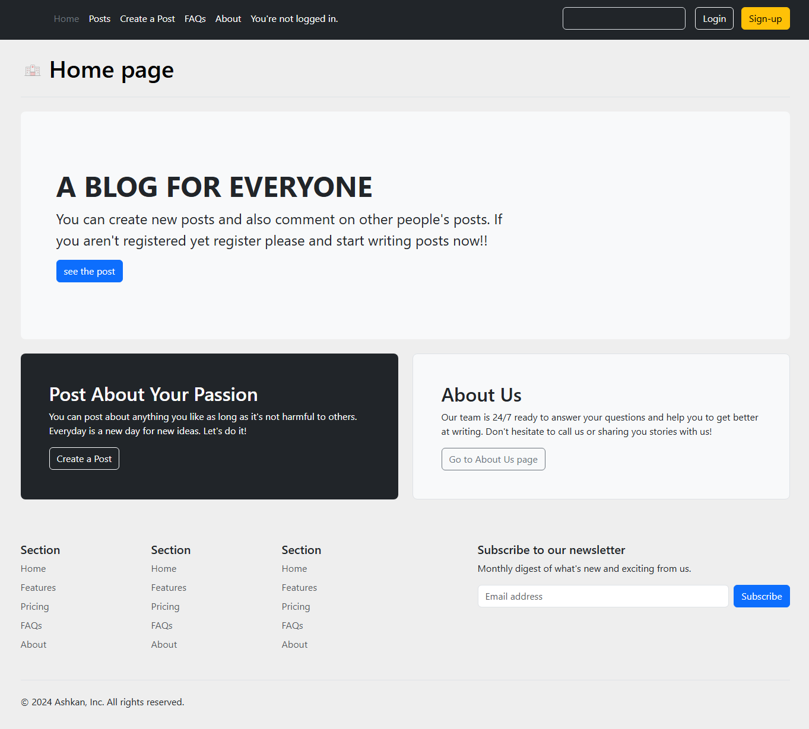

<p align="center">

</p>

# Django Blogging System with REST, GraphQL, Markdown, Media & Real-Time Notifications

A robust and modern blogging platform built with Django, featuring REST and GraphQL APIs, Markdown support with image/video embedding, a recommendation system, email backend, comment system, and automatic media cleanup.

---

## Features

- **Blog Posts & Comments**
  - Create, update, and manage posts and comments.
  - Nested comment support via DRF and GraphQL.
  - Comment upvote and downvote system.
  - Real-time reply notifications using Django Channels.
  - Sentiment analysis on user feedback to automatically categorize comments as positive, neutral, or negative.

- **API Support**
  -  **REST API** with Django REST Framework
  -  **GraphQL API** using Graphene-Django
  -  Token-based authentication

- **Markdown Editor**
  - SimpleMDE Markdown editor for rich-text content
  - Supports image and video embedding

- **Media Management**
  - Upload and display media (images/videos)
  - Automatic media cleanup with `django-cleanup`

- **Recommendation System**
  - Suggest related posts dynamically

- **Email Notifications**
  - Notify users on new posts or comments

---

## 🛠️ Tech Stack

- **Backend:** Django, DRF, Graphene-Django
- **Database:** PostgreSQL / SQLite
- **Auth:** Token-based authentication
- **Editor:** SimpleMDE
- **File Management:** django-cleanup
- **Media Support:** Markdown image/video embedding

---

##  Installation

```bash
git clone https://github.com/yourusername/blogging-platform.git
cd blogging-platform
pip install -r requirements.txt
python manage.py migrate
python manage.py runserver
```

##  App Configuration
```python
# settings.py

INSTALLED_APPS = [
    ...
    'simplemde',
    'django_cleanup.apps.CleanupConfig',
    ...
]

STATIC_URL = '/static/'
MEDIA_URL = '/media/'
MEDIA_ROOT = BASE_DIR / 'media'
```

## Markdown with SimpleMDE
1. Model Integration
```python
# models.py
from django.db import models
from simplemde.fields import SimpleMDEField

class Entry(models.Model):
    title   = models.CharField(max_length=250, verbose_name='Title')
    content = SimpleMDEField(verbose_name='Markdown content')

    def __str__(self):
        return self.title
```

2. Global Editor Settings
```python
# settings.py

SIMPLEMDE_OPTIONS = {
    'placeholder': 'Start writing in Markdown…',
    'status': False,            # hide status bar
    'autosave': {
        'enabled': True,
        'delay': 1000,         # milliseconds
    },
    # …any other SimpleMDE config keys
}
```

3. ModelForm & Widget Override
```python
# forms.py
from django import forms
from .models import Entry
from simplemde.widgets import SimpleMDEEditor

class EntryForm(forms.ModelForm):
    class Meta:
        model  = Entry
        fields = ['title', 'content']
```
```python
# For existing TextField override
# forms.py
from django import forms
from simplemde.widgets import SimpleMDEEditor
from .models import Post

class PostForm(forms.ModelForm):
    class Meta:
        model   = Post
        fields  = ['content']
        widgets = {
            'content': SimpleMDEEditor(),
        }
```

4. Django Admin Integration
```python
# admin.py
from django.contrib import admin
from simplemde.widgets import SimpleMDEEditor
from django.db import models
from .models import Entry

@admin.register(Entry)
class EntryAdmin(admin.ModelAdmin):
    formfield_overrides = {
        models.TextField: {'widget': SimpleMDEEditor},
    }
```

# Set up GraphQL using Graphene-Django.

### STEP 1: Install Requirements
In your terminal:
```
pip install graphene-django
```


Then add it to your INSTALLED_APPS in settings.py:
```python
INSTALLED_APPS = [
    ...
    'graphene_django',
]
```

And add this at the bottom of settings.py:

```python
GRAPHENE = {
    'SCHEMA': 'blog.schema.schema',  # you'll create this file below
}
```

### STEP 2: Create schema.py in your blog app
```python
# blog/schema.py

import graphene
from graphene_django.types import DjangoObjectType
from blog.models import Post, Comment, Tag

# --- Type Definitions ---
class TagType(DjangoObjectType):
    class Meta:
        model = Tag
        fields = ('id', 'title')

class CommentType(DjangoObjectType):
    class Meta:
        model = Comment
        fields = ('id', 'comment', 'author', 'created', 'active')

class PostType(DjangoObjectType):
    class Meta:
        model = Post
        fields = ('id', 'title', 'slug', 'author', 'publish', 'body', 'tags', 'comments')

# --- Queries ---
class Query(graphene.ObjectType):
    all_posts = graphene.List(PostType)
    post = graphene.Field(PostType, id=graphene.Int())

    def resolve_all_posts(root, info):
        return Post.published.all()

    def resolve_post(root, info, id):
        return Post.published.get(pk=id)

# --- Mutations ---
class CreateComment(graphene.Mutation):
    class Arguments:
        post_id = graphene.Int(required=True)
        comment = graphene.String(required=True)

    comment_obj = graphene.Field(CommentType)

    def mutate(self, info, post_id, comment):
        user = info.context.user
        if user.is_anonymous:
            raise Exception("Authentication required")

        post = Post.objects.get(pk=post_id)
        comment_obj = Comment.objects.create(
            post=post, author=user, comment=comment, active=False
        )
        return CreateComment(comment_obj=comment_obj)

class Mutation(graphene.ObjectType):
    create_comment = CreateComment.Field()

# --- Root Schema ---
schema = graphene.Schema(query=Query, mutation=Mutation)
```


###  STEP 3: Hook GraphQL into your URLs
```python
# in blog/urls.py (or your main urls.py if preferred):

from django.urls import path
from graphene_django.views import GraphQLView
from django.views.decorators.csrf import csrf_exempt

urlpatterns = [
    ...
    path("graphql/", csrf_exempt(GraphQLView.as_view(graphiql=True))),
]
```


###  STEP 4: Try It Out
```
# Visit http://127.0.0.1:8000/graphql/ to open the GraphiQL browser.
```


### Query Example:
```graphql
{
allPosts {
    title
    author { username }
    comments {
    comment
    author { username }
    }
}
}

<!-- Mutation Example: -->

mutation {
createComment(postId: 1, comment: "GraphQL is awesome!") {
    commentObj {
    comment
    author { username }
    }
}
}
```

### Now your Django app supports both REST and GraphQL APIs!
---


#  JWT Authentication with Django REST Framework + Simple JWT
Secure your API using JSON Web Tokens (JWT). This guide shows how to set it up and test it using the **ModHeader** browser extension.

###  1. Install Simple JWT
```bash
pip install djangorestframework-simplejwt
```

### 2. Update settings.py
```python
REST_FRAMEWORK = {
    'DEFAULT_AUTHENTICATION_CLASSES': (
        'rest_framework_simplejwt.authentication.JWTAuthentication',
    ),
}

# This is optional
from datetime import timedelta

SIMPLE_JWT = {
    'ACCESS_TOKEN_LIFETIME': timedelta(minutes=30),
    'REFRESH_TOKEN_LIFETIME': timedelta(days=1),
}
```

### 3. Add Token URLs to urls.py
```python
from rest_framework_simplejwt.views import TokenObtainPairView, TokenRefreshView

urlpatterns = [
    path('api/token/', TokenObtainPairView.as_view(), name='token_obtain_pair'),
    path('api/token/refresh/', TokenRefreshView.as_view(), name='token_refresh'),
]
```

### 4. Get a Token (use POSTMAN or Curl or ...)
```bash
/api/token/
```
With JSON body:
```bash
{
  "username": "your_username",
  "password": "your_password"
}
```
You’ll get:
```bash
{
  "access": "your_token_here",
  "refresh": "your_refresh_token"
}
```

### 5. Use JWT in ModHeader
Install ModHeader Extension and add a custom header:
```bash
Authorization: Bearer your_token_here
```


Finish:) Have fun!
